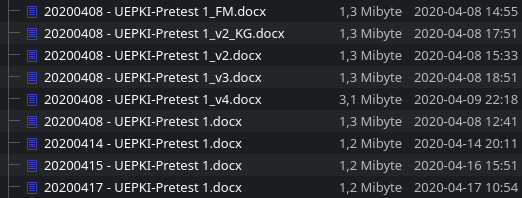

= Programmierpraktikum I: Übung 1 
:icons: font
:icon-set: fa
:source-highlighter: rouge
ifdef::env-github[]
:tip-caption: :bulb:
:note-caption: :information_source:
:important-caption: :heavy_exclamation_mark:
:caution-caption: :fire:
:warning-caption: :warning:
endif::[]
:experimental:

[quote, Rich Hickey]
Programming is not about typing, it's about thinking.


== Einführung `git`

Vorab: Welches Betriebssystem Sie hier verwenden, spielt in diesem Semester keine große Rolle. Da es aber viele verschiedene Kombinationen gibt, können wir leider nur sehr begrenzt bei technischen Fragen helfen. Wir setzen voraus, dass Sie sich selbst mit Ihrem System befassen und grundlegende Begriffe und Operationen erlernen und verstehen. Da wir uns am besten mit macOS und Linux auskennen, werden die Beispiele hier meistens für diese beiden Systeme geschrieben sein. Unter Windows bzw. dem Windows Subsystem für Linux (WSL) gibt es aber äquivalente Befehle. 

Sie haben in der Vergangenheit beim Arbeiten an Code oder gemeinsamen Erstellen von Dokumenten vielleicht schon mal am Ende so etwas hier gehabt:



Diese Art, verschiedene Versionen von Dateien zu verwalten und miteinander zu teilen wird sehr schnell unübersichtlich: Welche Änderungen gibt es wo von wem? Warum wurden die Änderungen vorgenommen? Wie kann einfach eine Änderungen zurückgenommen werden?

Um diese Probleme bei der Softwareentwicklung zu vermeiden, wurden Versionskontrollsysteme erfunden. Heute wollen wir uns mit den Grundlagen des weit verbreiteten Versionskontrollsystems `git` vertraut machen, denn dieses Versionskontrollsystem wird uns sowohl in diesem als auch im nächsten Semester begleiten. Aber auch quasi immer, wenn Softwareentwickler:innen an Projekten arbeiten, wird ein Versionskontrollsystem eingesetzt.

In dieser Übung werden wir zunächst die git-Befehle aus dem Wochenblatt wiederholen und praktisch anwenden.

NOTE: Wir gehen jetzt davon aus, dass Sie git wie auf dem Wochenblatt verlinkt installiert und eingerichtet haben.

Fangen wir zunächst ganz vorne an.

=== git Basics und Gitignore

TIP: Fragen Sie (die Person neben Ihnen bzw. den Chat oder uns) um Hilfe, wenn irgendwo etwas seltsames passiert.

1. Erstellen Sie auf Ihrem Computer einen leeren Ordner `uebung1` und wechseln Sie im Terminal in diesen Ordner (`mkdir`, `cd`).
2. Erstellen Sie ein leeren git-Repository im aktuellen ordner (`git init`).
3. Erstellen Sie eine Datei `README.adoc` und schreiben Sie `= Hallo :-)` in die Datei (Sie können dafür irgendeinen Text-Editor nehmen).
4. Führen Sie `git status` aus. Was steht auf der Konsole? Verstehen Sie alles, was in der Ausgabe steht?
+
NOTE: Mit unseren aktuellen Wissenstand können wir noch nicht alles erklären. Diese Wissenslücken schließen wir bis zum Ende des Semesters.
5. Fügen Sie die Datei `README.adoc` zur Staging-Area hinzu und erstellen Sie einen Commit mit einer aussagekräftigen Nachricht (`git add`, `git commit`).
+
TIP: Beim erstellen eines Commits (committen) geben Sie eine beschreibende Nachricht ein. Diese soll uns (und anderen) später helfen, nachzuvollziehen, was wir in unserem Code geändert haben und warum. Regelmäßiges Committen hilft uns später auch, wieder zu bestimmten Ständen zurückzuspringen oder Commits rückgängig zu machen. Die Commit-Nachrichten sollten daher kurz und prägnant sein und die Änderung sinnvoll beschreiben. Beispielsweise ist „Add Readme“ ein beschreibender Titel. Nachrichten wie „Add stuff“ oder „Minor change“ oder ähnliches sagen nichts aus und sollten vermieden werden.

6. Führen Sie `git push` aus. Welche Fehlermeldung erhalten Sie und warum? (Sie können weitermachen, auch wenn Sie gerade keine Antwort haben.)
7. Erstellen Sie ein neues Repository auf GitHub (auf github.com oben rechts auf das + klicken). Nennen Sie es z. B. `uebung1`. Setzen Sie die Sichtbarkeit auf privat. Initialisieren Sie das Repo _ohne_ README, gitignore oder License-Datei. Sie werden auf eine Seite weitergeleitet mit weiteren Anleitungen.
8. Führen Sie die drei Befehle aus „or push an existing repository from the command line“ in Ihrer Konsole aus.
+
IMPORTANT: Führen Sie niemals blind irgendwelche Befehle auf der Konsole aus, von denen Sie nicht wissen, was sie tun. Stellen Sie immer zuerst sicher, dass Sie wissen, was ein Befehl macht. Schauen Sie im Zweifel im Handbuch nach (z. B. mit dem Befehl `man git remote` – das Handbuch schließen Sie mit `q`). Was diese drei Befehle genau tun, klären wir später noch. Sie können für jetzt auch erstmal darauf vertrauen, dass nichts schlimmes passiert.

9. Schauen Sie sich auf GitHub an, was Sie nun gepusht haben, indem Sie die Repository-Seite in Ihrem Browser neu laden.
10. Mit `git log` sehen Sie auf der Konsole, welche Commits Sie nun erstellt (`HEAD -> main`) und veröffentlicht (`origin/main`) haben.

🥳 Sie haben nun die ersten Dateien gepusht und Sie können erfolgreich git verwenden!

TIP: Statt auf GitHub hätten Sie auch ein Online-Repository auf git.hhu.de anlegen können. Oder auf einem USB-Stick. git ist tatsächlich egal, wo die Gegenseite liegt und ob es überhaupt eine gibt.

=== Git-Repositories klonen

Wir arbeiten fast ausschließlich mit git, sei es zum praktischen Entwickeln von Software oder auch zum Zusammenstellen von Aufgaben für Sie. Daher erhalten Sie häufig einen GitHub-Classroom-Link, der Sie zu einem git-Repository führt. Diese Repos kann man auch lokal herunterladen und dort weiterarbeiten. 

1. Öffnen Sie das Repository mit dieser Aufgabenbeschreibung in Ihrem Browser.
2. Klicken Sie auf den grünen CODE-Button auf der Webseite von GitHub.
3. Stellen Sie sicher, dass `SSH` ausgewählt ist, und kopieren Sie die angezeigte Adresse.
4. Falls Sie noch im Ordner `uebung1` aus der vorherigen Aufgabe sind, wechseln Sie in einen anderen Ordner außerhalb des git-Repositories, bspw. in das übergeordnete Verzeichnis. (`cd ..`)
5. Klonen Sie das Repository: `git clone <die Adresse aus Schritt 3>`, beispielsweise: `git clone git@github.com:hhu-propra1/uebung-1-ihrnutzername.git`
+
IMPORTANT: In der Uni müssen Sie mit eduroam verbunden sein, damit das Klonen per SSH funktioniert.

6. Sie haben nun das Repository lokal verfügbar und können darin arbeiten. Wechseln Sie mit `cd` in den Ordner des Repositories. Mit `git log` sehen Sie die letzten Commits.

Wenn Sie ein Repository von einer Adresse geklont haben, wird automatisch hinterlegt, dass auch zur selben Adresse gepusht werden soll. Das müssten Sie jetzt also nicht mehr mit `git remote add` konfigurieren.

== Gradle & Collections

Sie haben jetzt geübt, wie Sie unsere Codevorgaben auf ihren eigenen Rechner kopieren (clonen) können, Zwischenstände (Commits) erzeugen können und wie Sie neue Commits in ein Remote-Repository kopieren (pushen) können. Dann machen wir jetzt mal wieder was „sinnvolles“ mit Code.

Ab jetzt arbeiten wir immer mit Gradle-Projekten. Zur Erinnerung: Der Java-Code liegt standardmäßig unter `src/main/java`. Dieser Pfad ist standardmäßig der Classpath, d. h. darunter beginnt die Package-Struktur. Das Projekt können Sie auf der Konsole mit dem Befehl `./gradlew run` ausführen (bzw. `gradlew.bat run` unter Windows).

Heute schauen wir uns Collections an, die uns endlich von den Plagen erlösen, die uns bei der täglichen Arbeit mit Arrays so bereitet haben :D Wir erhalten mit Javas Collections dynamische Datenstrukturen, die wir nach Belieben befüllen und verwenden können.
Wir werden uns nun praktisch den Umgang mit einigen Arten von Collections anschauen. Theoretisch haben Sie das schon am Ende der Programmierung gesehen.

=== Listen

NOTE: Wir arbeiten jetzt in der Datei link:src/main/java/propra/Zulassung.java[Zulassung.java] im Ordner `src/main/java/propra/`

Wir wollen nun ein paar Punktzahlen einer fiktiven Klausur anlegen und diese abspeichern.
In der Klasse `Zulassung.java` finden Sie die Methode `listen()`.

TIP: Für diese Aufgaben ist es praktisch, die https://docs.oracle.com/en/java/javase/21/docs/api/java.base/java/util/List.html[Dokumentation des List-Interfaces] offen zu haben. Vielleicht wollen Sie auch zu zweit arbeiten: Eine Person tippt Code, eine andere Person blättert in der Dokumentation und sagt, was zu tun ist. (https://en.wikipedia.org/wiki/Pair_programming[Pair Programming])

1. Erstellen Sie eine https://docs.oracle.com/en/java/javase/21/docs/api/java.base/java/util/ArrayList.html[ArrayList] `punktzahlen`: `List<Integer> punktzahlen = new ArrayList<>();`. Denken Sie an die notwendigen Imports. Das Package finden Sie oben auf der Dokumentationsseite.
+
.Spoiler
[%collapsible]
====
[source, java]
----
package propra;

import java.util.List;
import java.util.ArrayList;
----
====

2. Fügen Sie nun ein paar Werte („Punktzahlen“) in die Liste ein: `42, 23, 12, 54, 20`. Schauen Sie in der Dokumentation nach, wie Sie Werte einfügen können.
3. Löschen Sie das dritte Element in Ihrer Liste.
4. Geben Sie die Liste auf der Konsole mit einer For-Each-Schleife aus.
+
NOTE: Bei allen Typen, die das Interface `Iterable` implementieren, können Sie die foreach-Syntax verwenden, die Sie auch von Arrays kennen.

5. Sortieren Sie die Liste mit `Collections.sort()`. Welchen Rückgabewert hat diese Methode? Schauen Sie ggf. in der Dokumentation nach.
6. Berechnen Sie die Durchschnittspunktzahl. (Dafür gibt es keine fertige Methode.)
7. Experimentieren Sie weiter mit dieser Collection, wenn Sie wollen:
** Welche Funktionen gibt es noch?
** Was könnte man hier noch berechnen?
** Wie viele Punktzahlen sind größer als 30 Punkte und haben damit unsere fiktive Klausur bestanden?

=== HashMaps

NOTE: Wechseln Sie zu der Methode `hashmaps` in der Klasse `Zulassung`.

Nun ist es zwar schön, die Punktzahlen gesehen zu haben, aber wir haben die Informationen zu den Matrikelnummern der Studierenden ja gar nicht dabei!
Hierfür verwenden wir eine https://docs.oracle.com/en/java/javase/21/docs/api/java.base/java/util/HashMap.html[HashMap].
Eine HashMap speichert Schlüssel-Wert-Paare.
So können wir als Schlüssel beispielsweise eine Matrikelnummer und als Wert die Punktzahl aus der Klausur wählen.

1. Initialisieren Sie eine HashMap: `HashMap<Integer, Double> matrikelnummerPunkte = new HashMap<>();`. Vergessen Sie den Import nicht. ;)
+
NOTE: Auf dem nächsten Wochenblatt kümmern wir uns darum, dass Sie nicht mehr händisch importieren müssen.

2. Mit der Funktion `put` können Sie die Map mit Inhalten befüllen.
Nehmen Sie die Matrikelnummern `1942000, 1972300, 203400` und speichern Sie (irgendwelche) zugehörige Punktzahlen ab.
3. Was passiert, wenn Sie Ihr `HashMap`-Objekt in `System.out.println()` stecken?
4. Bei der Matrikelnummer 1942000 wollen wir eine andere Punktzahl hinterlegen.
Führen Sie `put` erneut mit der Matrikelnummer 1942000 aus, aber speichern Sie eine andere Punktzahl ab.
5. Geben Sie die Map auf der Konsole aus.
Haben sich Werte geändert?
6. Schlagen Sie eine Punktzahl in der Map nach, indem Sie `.get` auf der HashMap mit einer Matrikelnummer aufrufen.
7. Was passiert, wenn Sie eine Matrikelnummer nachschlagen, die nicht in der HashMap ist?
8. Was macht die Methode `getOrDefault`? Schlagen Sie in der Dokumentation nach. Probieren Sie die Methode aus.
9. Was vermuten Sie, was folgender Code tut? Testen Sie den Code.

[source, java]
----
for (Map.Entry<Integer, Double> eintrag : matrikelnummerPunkte.entrySet()) {
    System.out.println("%d hat %6.2f Punkte".formatted(eintrag.getKey(), eintrag.getValue()));
}
----

== Weiterführende Themen

Falls Sie während oder nach der Übung Langeweile haben, könnte Sie folgendes noch interessieren:

=== Zeitreisen mit git

In der History-Ausgabe von `git log` sehen Sie am Anfang Hexadezimalzahlen.
Mit diesen Zahlen wird jeder Commit eindeutig identifiziert.
Mithilfe dieser Zahl können Sie unter anderem zu dem jeweiligen Commit zurückspringen.

Wenn in der History-Anzeige z. B. die Commit-ID `3438791` steht, können Sie sich mit `git checkout 3438791` den Stand dieses Commits anzeigen lassen. Mit `git checkout main` kommen Sie wieder zurück zum aktuellen Stand.

IMPORTANT: `commit` sollten Sie immer nur auf dem aktuellen Stand ausführen, sonst passieren komische Dinge, die wir später erklären.

Was dort technisch im Hintergrund passiert, schauen wir uns später noch an.

=== Git-Prompt

Sie haben bei manchen Entwickler:innen vielleicht schon gesehen, dass sich die Prompt (die Textzeile im Terminal, hinter der Befehle eingetippt werden) verändert, wenn das aktuelle Verzeichnis zu einem git-Repo gehört:

```
~/propra % cd uebung1
(main↑1)~/propra/uebung1 %
```

In diesem Beispiel wird angezeigt, dass der aktuell gewählte Branch `main` heißt und ein Commit noch nicht gepusht ist.

NOTE: Was ein Branch ist und wie man sinnvoll damit arbeitet, erklären wir Ihnen später im Semester.

Wie Sie das für Ihre Konsole einrichten, hängt davon ab, welche Shell Sie verwenden (das ist grob gesagt das Programm, das innerhalb des Konsolenfensters ausgeführt wird und für das Entgegennehmen von Befehlen zuständig ist); Sie können meistens mit `echo $SHELL` herausfinden, welche Shell Sie verwenden. Suchen Sie dann im Internet nach `git prompt <Name der Shell>`, um herauszufinden, wie Sie die git-Statusinformationen in der Promptzeile anzeigen lassen können.
